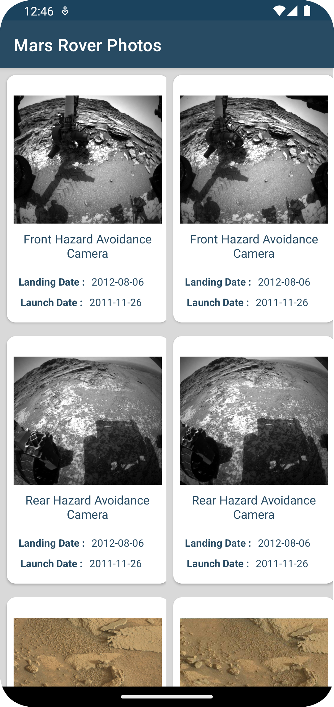
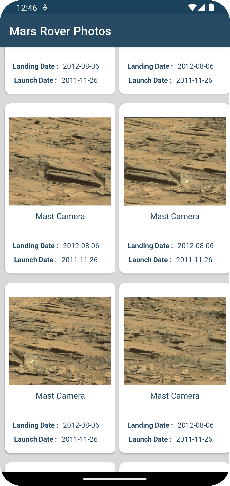

# Mars Rover Photos

Getting Mars Rover Photos using api

## Screenshot

 

## Build
- Get api key for mars rover photo data from nasa_api : https://api.nasa.gov/
- Put your api keys to utils/Constants.kt (API_KEY)
